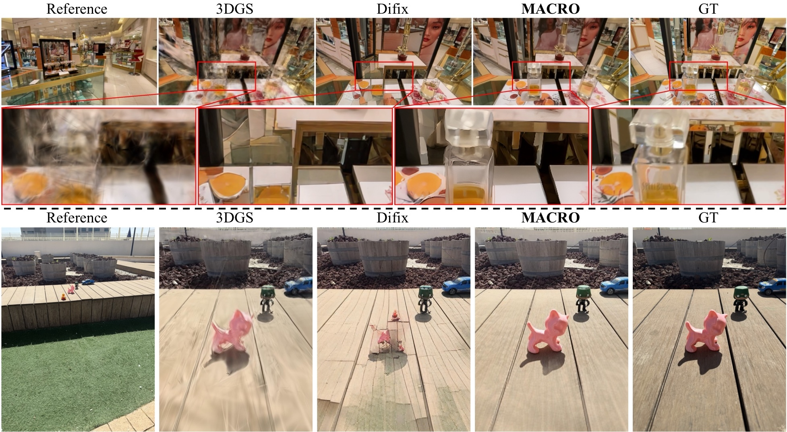
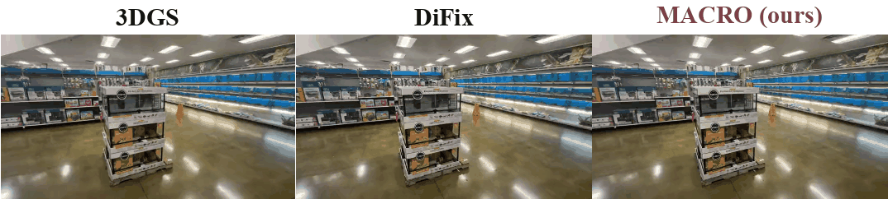

<h1 align="center">MACRO: Training-free Multi-plane Attention for Closeup Render Optimization</h1>

<p align="center">
  <a href="https://nitzanhod.github.io/">Nitzan Hodos</a>,
  <a href="https://scholar.google.com/citations?user=basR76gAAAAJ">Roy Amoyal</a>,
  <a href="https://scholar.google.com/citations?user=tVSZmfgAAAAJ">Lior Fritz</a>,
  <a href="https://scholar.google.com/citations?user=uOzy7KgAAAAJ">Ianir Ideses</a>,
  <a href="https://sagiebenaim.github.io/">Sagie Benaim</a>,
  <a href="https://scholar.google.com/citations?user=L0cJiRwAAAAJ">Netalee Efrat</a>
</p>

<p align="center">
  <a href="https://nitzanhod.github.io/MACRO/">🌐 Project Page</a> &nbsp;|&nbsp;
  <a href="https://arxiv.org/abs/2607.03875">📄 arXiv</a> &nbsp;|&nbsp;
  <a href="#data">💾 Data</a>
</p>

<p align="center">
  
</p>

<p align="center">
  <br>
  <em>Wide→close→wide fly-in on a DL3DV-Closeup scene: raw 3DGS vs. DiFix vs. MACRO (ours).</em>
</p>

MACRO enhances close-up 3DGS renders by fixing the **scale gap** in reference-conditioned
diffusion - it decomposes the close-up view into depth planes and matches each to rescaled
reference crops, via depth-aware cross-attention. It is **training-free** (no fine-tuning,
no architectural changes) and sets state of the art on two new close-up novel view
synthesis benchmarks.

The pipeline: **train 3DGS on the sparse wide-shot images → run the eval driver**, which
internally renders each close-up + its depth from the trained Gaussians, MACRO-enhances
them, and scores against the ground-truth close-ups.

---

## Installation

```bash
conda create -n macro python=3.9 -y
conda activate macro
pip install -r requirements.txt
# gsplat needs a matching CUDA toolkit; if the pip wheel fails, build from source:
#   pip install git+https://github.com/nerfstudio-project/gsplat.git@v1.4.0
```

**PFT-SR weights** (reference super-resolution, part of the pipeline): get the pretrained
models from the official [PFT-SR repo](https://github.com/CVL-UESTC/PFT-SR) - we use
`103_PFT_light_SRx4_finetune.pth` and `101_PFT_light_SRx2_scratch.pth` - put them in one
folder and point an env var at it:

```bash
export PFT_SR_WEIGHTS=/path/to/pft_sr_weights   # folder with the two PFT .pth files
```

---

## Data

MACRO is evaluated on two close-up benchmarks. A **scene folder** is what the eval driver
consumes:

```
<scene>/
  images/          # training wide-shot photos (COLMAP-registered)
  closeup_gt/      # ground-truth close-up photos (for scoring)
  sparse/0/        # COLMAP model: cameras.bin, images.bin, points3D.bin, ...
  split.json       # train/closeup split, close-up poses, intrinsics
```

`split.json` keys: `training_frames` (DL3DV) **or** `train_frames` (MobileClose) - the
code accepts either - plus `closeup_eval_pairs`, `closeup_poses`, `intrinsics`.

### DL3DV-Closeup (40 scenes)

DL3DV-Closeup is a set of close-up splits over scenes from the public
[DL3DV-10K Benchmark](https://github.com/DL3DV-10K/Dataset). The 40 `split.json` files are available at
[`data/DL3DV-Closeup/`](data/DL3DV-Closeup). To evaluate, assemble a scene folder from **your local DL3DV-10K Benchmark** copy so it matches the [scene-folder layout](#data) above, using the split as the manifest:

- `split.json` → copy our file as is.
- `images/` → the frames listed in `training_frames`, taken from the scene's DL3DV
  images (we used `nerfstudio/images_4`, a.k.a. `data_factor: 4`).
- `closeup_gt/` → the CLOSEUP frames named in `closeup_poses` / `closeup_eval_pairs`
  (`closeup_frame`), same source.
- `sparse/0/` → a COLMAP model covering those views (the scene's DL3DV
  `nerfstudio/colmap`, or COLMAP re-run on the selected frames).

Then `python verify_scene.py DL3DV-Closeup/<scene_id>` to confirm the folder is complete.
See [`data/DL3DV-Closeup/README.md`](data/DL3DV-Closeup/README.md) for the exact field
reference.

### MobileClose-10 (10 scenes)

We captured these ourselves (photos + COLMAP), so full scene folders are provided:

> **📦 [MobileClose-10 (Google Drive)](https://drive.google.com/drive/folders/1VgBv6OPBJRnau6m6SluXLdMnTMyCAxWn?usp=sharing)** - `MobileClose-10.tar.gz`


```bash
tar xzf MobileClose-10.tar.gz               # -> MobileClose-10/<scene>/...
python verify_scene.py MobileClose-10 --all
```

The drive also includes `smoke_ckpt_cactus.tar.gz` - a pre-trained 3DGS checkpoint for the
`cactus` scene. To immediately test enhancement, extract it so that
`MobileClose-10/cactus/results/ckpts/ckpt_29999.pt` exists, then skip Step 1 below.

---

## Usage

**1. Train 3DGS on the scene's sparse wide shots** (standard [gsplat](https://github.com/nerfstudio-project/gsplat) trainer - no custom code needed):

```bash
# from a gsplat checkout (examples/simple_trainer.py), or `pip install gsplat` then:
CUDA_VISIBLE_DEVICES=0 python simple_trainer.py default \
  --data-dir MobileClose-10/cactus \
  --data-factor 1 \
  --result-dir MobileClose-10/cactus/results \
  --disable-viewer
```

Training writes `MobileClose-10/cactus/results/ckpts/ckpt_*.pt`. 

MACRO's eval driver loads that checkpoint (`ckpt["splats"]` with
`means/quats/scales/opacities/sh0/shN` - the stock gsplat format) and renders the
close-up + depth from it; no MACRO-specific training is involved.

**2. Render the close-ups, MACRO-enhance, and score:**

```bash
export PFT_SR_WEIGHTS=/path/to/pft_sr_weights
python src/evaluate.py \
  --scene-dir MobileClose-10/cactus \
  --gpu 0 \
  --configs macro \
  --results-dir results_out
```

This one command renders each close-up's RGB **and** depth from the trained Gaussians
(saved as an intermediate `plus_renders/`), runs the enhancement, and scores against
`closeup_gt/`. No manual rendering or pre-computed depth is required.

Config names: `3dgs` (raw render, no enhancement), `difix` (single-reference DiFix
baseline), `macro` (ours), `macro_unmasked` (ablation of the depth-aware mask). By default
all of a scene's close-up pairs (the entries in `split.json` → `closeup_eval_pairs`) are
evaluated; pass `--pair-index N` (0-based, `0 ≤ N < len(closeup_eval_pairs)`) to run just
one pair.

**3. Aggregate a results table across scenes:**

```bash
python scripts/aggregate_results.py --results-dir results_out --configs 3dgs difix macro
```

GPU note: set `SR_GPU_ID` to a GPU distinct from `--gpu` so PFT-SR doesn't contend for memory.

---

## Citation

```bibtex
@article{hodos2026macro,
  title         = {MACRO: Training-free Multi-plane Attention for Closeup Render Optimization},
  author        = {Nitzan Hodos and Roy Amoyal and Lior Fritz and Ianir Ideses and Sagie Benaim and Netalee Efrat},
  year          = {TBD},
  journal       = {TBD},
  eprint        = {TBD},
  archivePrefix = {arXiv},
  primaryClass  = {TBD},
  url           = {TBD}
}
```

## License

See [LICENSE.txt](LICENSE.txt). Built on [gsplat](https://github.com/nerfstudio-project/gsplat);
uses [DiFix](https://github.com/nv-tlabs/Difix3D) and [PFT-SR](https://github.com/CVL-UESTC/PFT-SR).
